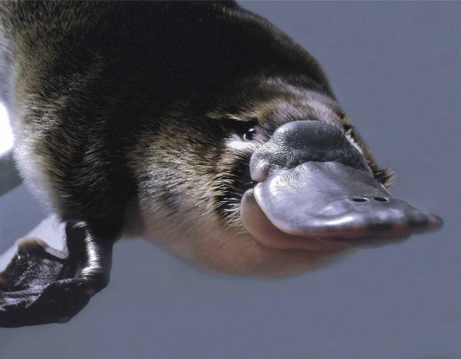

# Ornithorynque

IL EST TROP MIGNON

L'Ornithorynque respire la classe. L'herbe de plie en signe de respect avant même qu'il passe dessus.

Caractéristiques
L'Ornithorynque est un carnivore qui aime se taper des poissons, crevetts, crustacés, mais aussi leurs oeufs parce qu'il est metal AF.
Il n'est pas un animal domestique parce qu'il ne se soumet pas à la barbarerie humaine.
Il a deux résidences de milliardaire de batard, une en Australie et une en Tanzanie.

Sous espèces
L'Ornythorinque est la création parfaite de son Papa et de sa Maman, et n'est donc pas un sous-être.